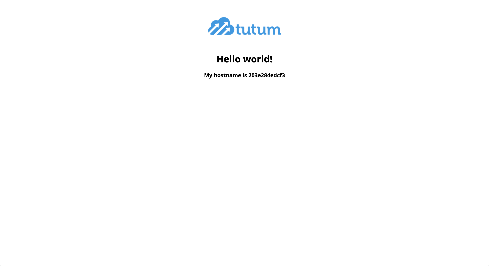

# Envoy EDS XDS Server

This is the example of the envoy xds server implementation using grpc streaming api. This example only cover EDS (Endpoint Discovery Service).

## Prerequisite

In order to understang this example you should have basic understanding of envot concepts like Cluster, Listener, Route, Endpoint, etc. Basic example of [envoy](https://www.envoyproxy.io/docs/envoy/latest/start/quick-start/run-envoy#run-envoy-with-the-demo-configuration).

## xDS

Usecase of xDS server described by envoy documentation. `Envoy discovers its various dynamic resources via the filesystem or by querying one or more management servers. Collectively, these discovery services and their corresponding APIs are referred to as xDS.`

Envoy provides a way to dynamically configure proxy. In which xDS server can be used. More details about xDS in on [envoy documentation](https://www.envoyproxy.io/docs/envoy/latest/api-docs/xds_protocol#rpc-services-and-methods-for-each-variant).

## Quick start

It is recommended to use `docker-compose` to run the example.

```bash
git clone https://github.com/aminmithil/envoy-eds.git

cd envoy-xds

docker-compose up -d
```

Once all container comes up. you should be able to open a browser to [http://localhost:10000](http://localhost:10000). Browser will look something like below.



## References

https://github.com/envoyproxy/go-control-plane/tree/master/internal/example
